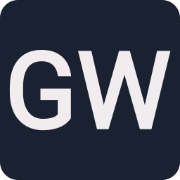
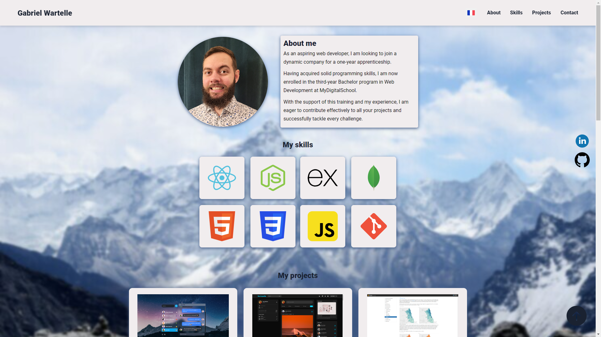
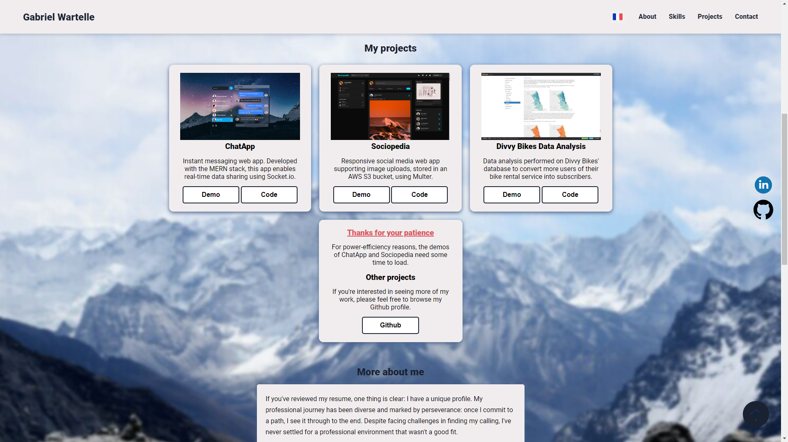
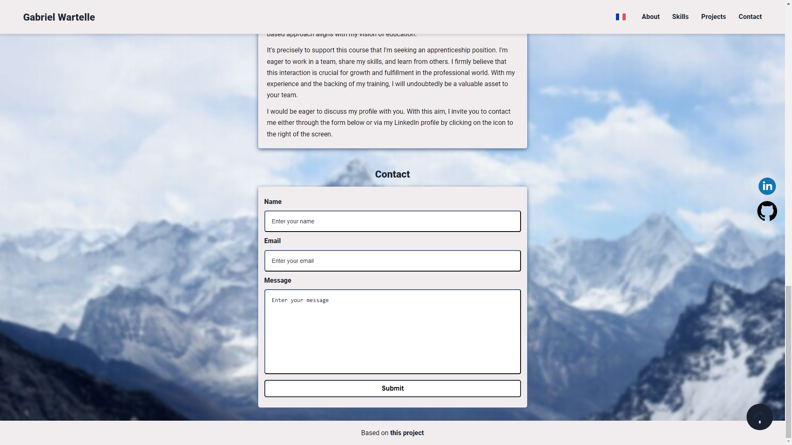

<a id="readme-top"></a>

<!--
*** This README is built upon the Best-README-Template, created by Othneil Drew.
*** If you wish to use this template, go check his repository :
*** https://github.com/othneildrew/Best-README-Template/tree/master
*** And don't forget to give his project a star!
-->

<!-- PROJECT TITLE -->

<div align="center">
  <a href="https://gwartelle.github.io/MyPortfolio/" target="_blank" rel="noopener noreferrer">
    
  </a>
</div>
<h1 align="center">My Portfolio</h1>

<!-- TABLE OF CONTENTS -->

<details>
  <summary>Table of Contents</summary>
  <ol>
    <li>
      <a href="#about-the-project">About The Project</a>
      <ul>
        <li><a href="#built-with">Built With</a></li>
      </ul>
    </li>
    <li><a href="#folder-structure">Folder Structure</a></li>
    <li><a href="#cloning-the-project">Cloning the project</a></li>
    <li><a href="#usage">Usage</a></li>
    <li><a href="#modifications">Modifications</a></li>
    <li><a href="#contact">Contact</a></li>
    <li><a href="#acknowledgments">Acknowledgments</a></li>
    <li><a href="#license">License</a></li>
  </ol>
</details>

<!-- ABOUT THE PROJECT -->

<h2 id="about-the-project">About The Project</h2>



If you want to take a direct look at my portfolio, you can do so right [here](https://gwartelle.github.io/MyPortfolio/).

This portfolio was built following this [tutorial](https://www.freecodecamp.org/news/how-to-build-a-developer-portfolio-website/).

As I needed a mean to showcase my projects, I searched for a portfolio template, and I stumbled upon this one on [freeCodeCamp](https://www.freecodecamp.org/).
I liked its style and simplicity, so I dedided to build upon this one.

This portfolio is built simply using HTML, CSS and Javascript.
The only external tools used are [Ion Icons](https://ionic.io/ionicons) for the hambuger menu bar used on smaller screens, [Formspree](https://formspree.io/) for handling the contact form submisions, and [SVGRepo](https://www.svgrepo.com/) for the various svg icons used throughout this portfolio.

My portfolio is hosted on [GitHub Pages](https://pages.github.com/).

<p align="right">(<a href="#readme-top">back to top</a>)</p>

<h3 id="built-with">Built With</h3>

[](https://developer.mozilla.org/docs/Web/HTML)
[](https://developer.mozilla.org/docs/Web/CSS)
[](https://developer.mozilla.org/docs/Web/JavaScript)

<p align="right">(<a href="#readme-top">back to top</a>)</p>

<!-- FOLDER STRUCTURE -->

<h2 id="folder-structure">Folder Structure</h2>

The `index.html`, `README.md` and `LICENSE` files are in the root folder..

The `assets/` folder is divided into five folders: `css/` for the styles, `icons/` with all the icons, `images/` with all the images, `js/` for the script and `locales/` for the translations.

<p align="right">(<a href="#readme-top">back to top</a>)</p>

<!-- CLONING THE PROJECT -->

<h2 id="cloning-the-project">Cloning the project</h2>

If you want to clone this project, you don't need to install anything aside from [Git](https://git-scm.com/downloads).

1. To clone this project, first go in the directory you want to install the project in :

   ```sh
   cd path/to/your/directory
   ```

2. And then run this command to clone the project :

   ```sh
   git clone https://github.com/GWartelle/MyPortfolio.git
   ```

You only need to open `index.html` into the browser of your choice to see what the portfolio looks like.

<p align="right">(<a href="#readme-top">back to top</a>)</p>

<!-- USAGE EXAMPLES -->

<h2 id="usage">Usage</h2>


At the top of the screen you'll find the header.
On the left-hand side, we have my full name, which links to the [repository](https://github.com/GWartelle/MyPortfolio) for this portfolio.
On the right-hand side, there's the navigation bar, with a flag for switching between the french and english translations, followed by a link to the different parts of the portfolio.

Aside from that, on the right of the screen there are two icons linking respectively to my `LinkedIn` and `GitHub` profiles in the middle, and one at the bottom that links to the top of the page.

On the main page, you have my profile picture, along with a short `About me` section as an introduction.
And under this, there's the `My skills` section, with a tileset of my main skills.



Next we have the `My projects` section.
Here, there are three tiles, with each a different project to showcase.
Each project has a `Demo` button that links to the deployed project, and a `Code` button that links to the project's repository on github.

Right underneath the projects, there's a fourth tile.
On this tile there's a first part with a warning specifying that the first two projects take some time to load, due to the server they're hosted on, and a second part `Other projects` with another link to my `Github` profile.

After the projects section, there is a `More about me` section, with a more detailed presentation of my profile.



At the bottom of the portfolio there's a `Contact` section with a contact form, asking the visitor to enter their name, their email address, and their message.
Once submitted, the message is directly sent to my email address thanks to [Formspree](https://formspree.io/).

And finally, there's a footer with a link to the project's repository that this Portfolio is based on.

<p align="right">(<a href="#readme-top">back to top</a>)</p>

<!-- MODIFICATIONS -->

<h2 id="modifications">Modifications</h2>

Compared to the original portfolio, I obviously adapted the content to suit my profile, but I also changed some things here and there : I changed the background and added the profile picture, I added two tiles to the `My skills` section and adapted it to behave correctly on smaller screens, I put two buttons for each project instead of a simple link, etc...

But one interesting thing I added to this portfolio is the translations, to have both French and English.

And I wanted to share with you how I did to implement this.
Instead of having two separate `.html` files, with each a different translation, I opted to control which language is on screen with javascript, using two `.json` files to hold the different translations.

To target which element on the screen needs to be translated, I used `data-i18n` attributes :

```html
[...]
<h2 class="skills-header" data-i18n="skills_header"></h2>
[...]
```

And the `.json` files simply had to hold the translation for each of the `data-i18n` attributes :

```js
{
  [...],
  "skills_header": "My skills",
  [...],
}
```

The next thing to do was to implement the javascript logic to handle the different translations :

```js
// Load translations
const loadTranslations = (lang) => {
  fetch(`assets/locales/${lang}.json`)
    .then((response) => response.json())
    .then((data) => {
      // Update HTML elements with translations
      const dataI18n = document.querySelectorAll("[data-i18n]");
      dataI18n.forEach((element) => {
        const key = element.dataset.i18n;
        [...]
        element.textContent = data[key];
      });

      [...]

      // Update the flag visibility
      const flagEn = document.querySelector(".flag-en");
      const flagFr = document.querySelector(".flag-fr");
      flagFr.style.display = lang === "en" ? "inline" : "none";
      flagEn.style.display = lang === "fr" ? "inline" : "none";
    });
};

// Set the language to French by default
loadTranslations("fr");

// Add language toggle functionality
const languageToggle = document.querySelector("#language-toggle");
languageToggle.addEventListener("click", () => {
  const currentLang = document.documentElement.lang;
  const newLang = currentLang === "fr" ? "en" : "fr";
  loadTranslations(newLang);
});
```

In this javascript code we find the `loadTranslations` function which takes `lang` as parameter. The first thing this function does is to fetch the `.json` file with the translation for the language defined by `lang`, and then parses it for further processing.

Then, after selecting all the elements with a `data-i18n` attribute, the function loops over each one of them, gets the `key` held in this attribute, and replaces the content of the element with the value held by the corresponding key in the fetched `.json` file.

Here, I intentionnally removed some parts of the `loadTranslations` function that simply took care of some specific cases of `data-i18n` elements.

The last part of the function takes care of the flag buttons' visibility, based on the `lang` parameter.

Once the `loadTranslations` function was done, I simply had to set the default language by calling it a first time.

Lastly, after selecting the `languageToggle` (the flag icons), I added a `click` event listener to it that uses the `loadTranslations` function with the opposite language of the current one as a parameter.

And that's all for the language toggle feature !

<p align="right">(<a href="#readme-top">back to top</a>)</p>

<!-- CONTACT -->

<h2 id="contact">Contact</h2>

If you want to see more of my work, I invite you to take a look at my [github](https://github.com/GWartelle),

And if you'd like to get in touch with me, feel free to reach out on [LinkedIn](https://www.linkedin.com/in/gabriel-wartelle/).

<p align="right">(<a href="#readme-top">back to top</a>)</p>

<!-- ACKNOWLEDGMENTS -->

<h2 id="acknowledgments">Acknowledgments</h2>

As mentionned above, this project was made following this [tutorial](https://www.freecodecamp.org/news/how-to-build-a-developer-portfolio-website/).
So I would like to thank its creator for his amazing work.
If you want to go check the github of his tutorial you can do so right [here](https://github.com/Ksound22/developer-portfolio).
Feel free to give him a star, as his work was well structured and his explanations clear and useful.
Also, I'd like to thank [freeCodeCamp](https://www.freecodecamp.org/), for freely hosting such amazing content.

And of course I would like to thank you for taking the time to read through all this !
I wish you the best 😁

Have a great day 😉

<p align="right">(<a href="#readme-top">back to top</a>)</p>

<!-- LICENSE -->

<h2 id="license">License</h2>

Distributed under the MIT License. See [opensource.org](https://opensource.org/license/mit) for more information.

<p align="right">(<a href="#readme-top">back to top</a>)</p>
